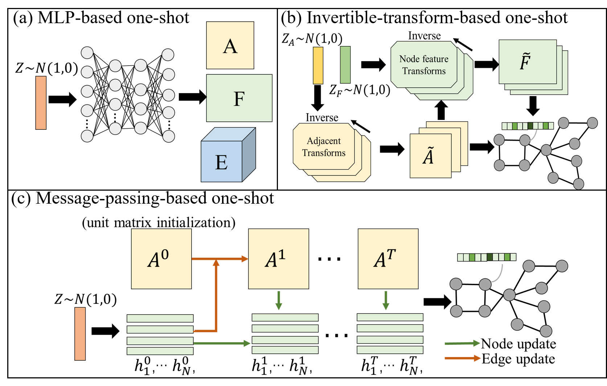

# Dataset-for-Deep-Graph-Generation
This page summarize and provide the data and applications for the deep graph generation problem. The deep graph generation problem aims to learn the distribution of the observed graphs atomatically by oberving large amount of training graph based on the deep learning methods. Then more novel graphs can be generated by sampling from this learnt distribution; To avoid loss of generality, the graph in this problems can be all kinds of graphs, such as directed/undirected graphs, sign graphs, and multi-attributed graph. The existing benchmark datasets that are typically used in this domain can be categorized into synthetic datasets and real-world datasets. We have collected and published all  the datasets.

 

## Synthetic Graphs

### Community.   
It contains 500 two-community graphs with 60≤ |V| ≤160. Vdenotes the node set of a graph. Each community is generated by the Erdos–Renyi model(E-R) withn=|V|/2 nodes and the link probability of p= 0.3. 

[Community]()

#### Acknowledgements
Please cite formally when you use these dataset as:

### Grid. 
It contains 100 standard 2D grid graphs with 100 ≤ |V| ≤ 400 and 100 standard large 2D grid graphs with 1296 ≤ |V| ≤ 2025.

[Grid]()

#### Acknowledgements
Please cite formally when you use these dataset as:

### Ego. 
It contains 757 3-hop ego networks extracted from the Citeseer network [151] with 50 ≤ |V| ≤ 399. Nodes represent documents and edges represent citation relationships

[Ego]()

#### Acknowledgements
Please cite formally when you use these dataset as:

### B-A. 
500 graphs with 100 ≤ |V| ≤ 200 that are generated using the Barabasi-Albert model. During generation, each node is connected to 4 existing nodes

[B-A]()

#### Acknowledgements
Please cite formally when you use these dataset as:

### Cycles. 
A synthetic dataset of graphs with cyclically connected nodes. Each graph is a path with its two endnodes connected. 500 graphs are generated with size of 10 ≤ |V| ≤ 100.

[Cycles]()

#### Acknowledgements
Please cite formally when you use these dataset as:

### Trees. 
A synthetic dataset of 500 trees (10 ≤ |V| ≤ 100) with power law degree distributions. To generate a tree, a trial power law degree sequence is chosen and then elements are swapped with new elements from a powerlaw distribution until the sequence makes a tree. Ladder. A synsthtic dataset of ladder graphs with 10 ≤ |V| ≤ 100, resulting in a total size of 180 graphs. This is two paths of |V|/2 nodes, with each pair connected by a single edge

[Trees]()

#### Acknowledgements
Please cite formally when you use these dataset as:

## Real-world Graphs

### QM9
It is an enumeration of around 134k stable organic molecules with up to 9 heavy atoms (carbon, oxygen, nitrogen and fluorine). As no filtering is applied, the molecules in this dataset only reflect basic structural constraints.

[QM9]()

#### Acknowledgements
Please cite formally when you use these dataset as:

### ZINC 
This dataset is a curated set of 250k commercially available drug-like chemical compounds. On average, these molecules are bigger (about 23 heavy atoms) and structurally more complex than the molecules in QM9.

[ZINC]()

#### Acknowledgements
Please cite formally when you use these dataset as:

### CEPDB
This dataset consists of organic molecules with an emphasis on photo-voltaic applications. The contained molecules have 28 heavy atoms on average and contain six to seven rings each.

[CEPDB]()

#### Acknowledgements
Please cite formally when you use these dataset as:

### Protein. 
This dataset contains 918 protein graphs with 100 ≤ |V| ≤ 500. Each protein is represented by a graph, where nodes are amino acids and two nodes are connected if they are less than 6 Angstroms apart.

[Protein]()

#### Acknowledgements
Please cite formally when you use these dataset as:

### Enzymes.
This dataset contains protein tertiary structures representing 600 enzymes. Nodes in a graph (protein) represent secondary structure elements, and two nodes are connected if the corresponding elements are interacting. The node labels indicate the type of secondary structure, which is either helices, turns, or sheets.

[Enzymes]()

#### Acknowledgements
Please cite formally when you use these dataset as:

### Citation graph
Cora and Citeseer are citation networks; nodes correspond to publications and an edge represents one paper citing the other. Node labels represent the publication area. The Cora dataset contains 2708 nodes, 5429 edges, 7 classes and 1433 features per node. The Citeseer dataset contains 3327 nodes, 4732 edges, 6 classes and 3703 features per node.

[Cora]()

[Citeseer]()

#### Acknowledgements
Please cite formally when you use these dataset as:
